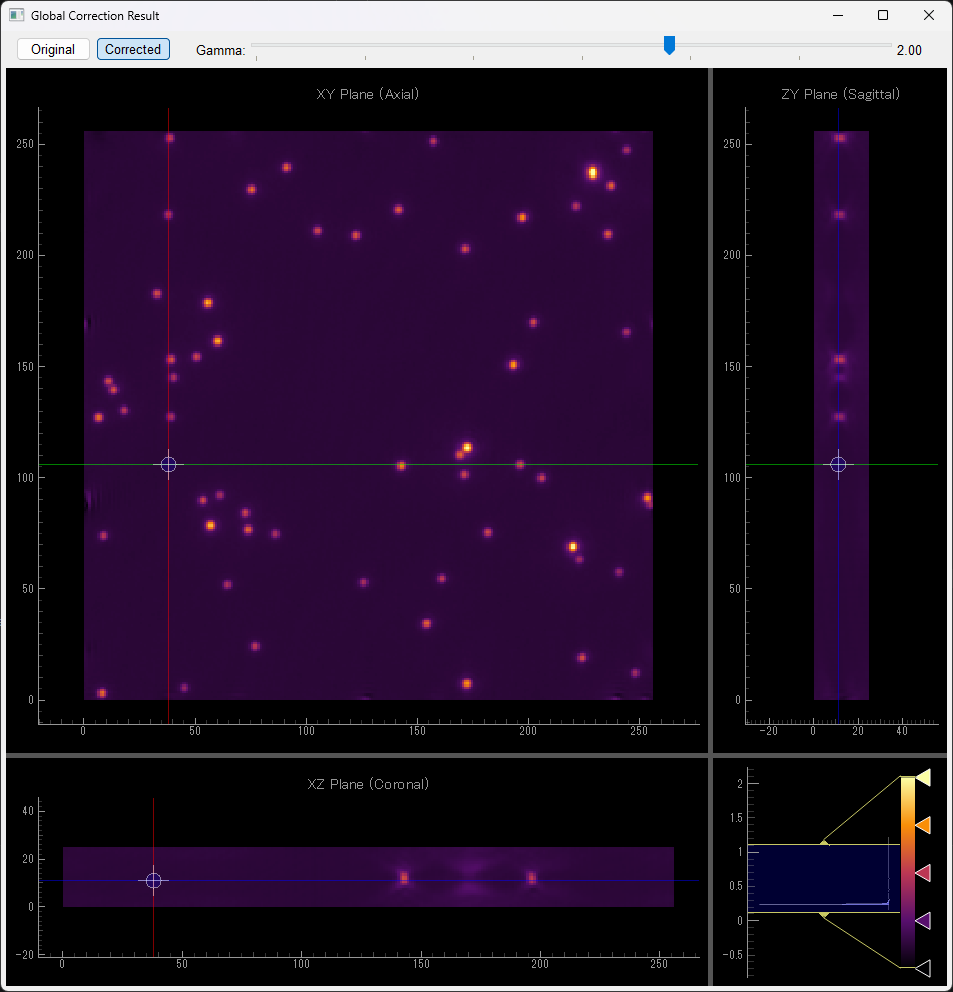
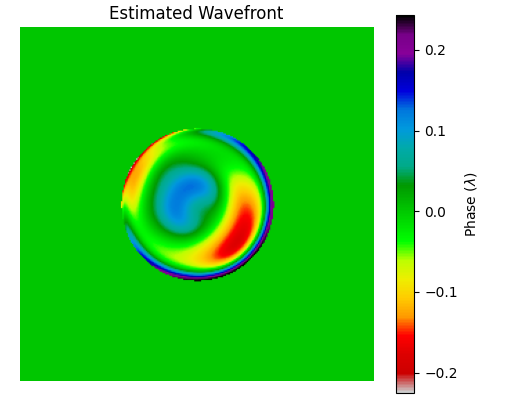
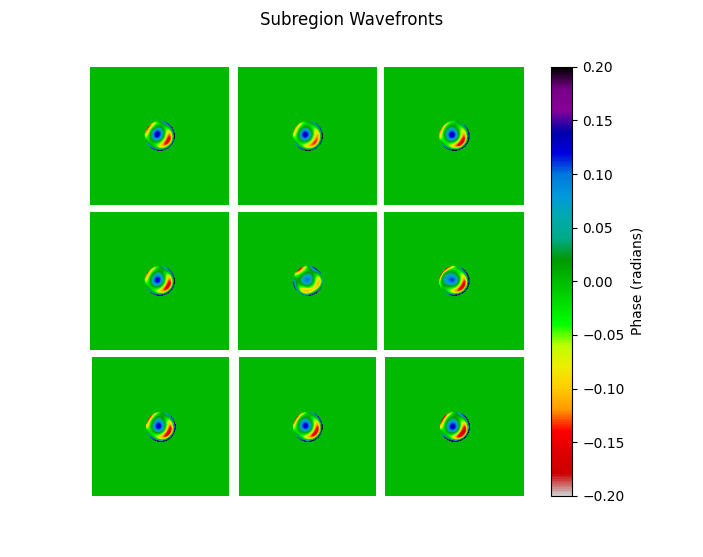

# $\phi$ CAO PyTorch Implementation

This repository provides a PyTorch implementation of the **Phase-Based Computational Adaptive Optics ($\phi$ CAO)** algorithm, as described in the open-access paper by Atsushi Matsuda et al.

## Paper Information
- **Title**: Phase-Based Computational Adaptive Optics Enables Artifact-Free Super-Resolution Microscopy
- **Authors**: Atsushi Matsuda, Carlos Mario Rodriguez-Reza, Yosuke Tamada, Yamato Matsuo, Takaharu G. Yamamoto, Takako Koujin, Peter M. Carlton
- **Journal**: Communications Engineering (Nature Portfolio)
- **DOI**: [10.1038/s44172-026-00622-7](https://doi.org/10.1038/s44172-026-00622-7)

## Overview
$\phi$ CAO is a powerful method for correcting wavefront aberrations in microscopy without requiring additional hardware like deformable mirrors. This implementation leverages PyTorch for efficient gradient-based optimization to estimate Zernike coefficients and reconstruct aberration-free images.

## Requirements
- Python 3.8+
- PyTorch
- NumPy
- Matplotlib
- PyQt5 (for the orthogonal viewer)
- pyqtgraph (for the orthogonal viewer)

```bash
pip install torch numpy matplotlib PyQt5 pyqtgraph
```

## Getting Started

### 1. Data Preparation
While the sample scripts include a loader for `.dv` files (common in microscopy), the core implementation is format-agnostic. You can use any 3D image stack as long as it is provided as an array or tensor with the shape **(z, y, x)**.

#### Sample Data
The original authors have provided sample `.dv` files on **Zenodo**:
- **Zenodo Repository**: [https://zenodo.org/records/15826325](https://zenodo.org/records/15826325)

You can download files such as `Fig1d_beads_original.dv` from the link above to test this implementation.

### 2. Running Samples
The `example/` directory contains sample scripts. 

**Important**: Before running the scripts, you must open the `.py` file (e.g., `sample1_global_optimization.py`) and update the `path` variable to point to the actual location of your downloaded `.dv` file.

```python
# In example/sample1_global_optimization.py
path = "path/to/your/downloaded_file.dv"  # Update this!
```

#### Global Optimization
Performs aberration correction for the entire field of view.
```bash
python example/sample1_global_optimization.py
```

#### Subarea Optimization
Dividing the image into sub-regions to handle spatially-variant aberrations.
```bash
python example/sample2_subarea_optimization.py
```

### 3. Visualizing Results (Orthogonal Viewer)
The sample scripts include an integrated **Orthogonal Viewer** (built with PyQt5 and pyqtgraph) to inspect the 3D image stack from XY, XZ, and YZ planes. This is particularly useful for verifying the axial (Z) resolution improvement after $\phi$ CAO correction.

  

## Sample Execution Results

### Global Optimization Results
  

### Subarea Optimization Results
  


## Errata (Suspected Errors in the Paper)
During implementation, we noticed a potential inconsistency in the mathematical derivations presented in the original paper.

### Equation (10) vs. Equation (19)
We identified that **Equation (10)** is likely incorrect when compared to the logic established in **Equation (19)**.

- **Implementation Note**: This repository uses the **Implemented Version** shown below, which is used in `src/phicao.py`. 

---
## Implementation Details: Phase Correction Formula

The core implementation in this repository follows a modified version of the original paper's formula to ensure numerical stability.

### Mathematical Formulations

- **Original in Paper**:
  
$$
D^{\prime}(k_x, k_y, k_z, \psi, \alpha) = 
\begin{cases} 
\frac{D(k_x, k_y, k_z)}{A(k_x, k_y, k_z) \mathrm{e}^{\mathrm{i} \varnothing^{\prime}(k_x, k_y, k_z, \psi, \alpha)} + w^2} & (k_x < k_{max}, k_y < k_{max}, k_z < k_{max}) \\ 
0 & (k_x \geq k_{max}, k_y \geq k_{max}, k_z \geq k_{max}) 
\end{cases}
$$

- **Corrected Version (Derived from Eq 19)**:
  
$$
D^{\prime}(k_x, k_y, k_z, \psi, \alpha) = 
\begin{cases} 
\frac{A(k_x, k_y, k_z) D(k_x, k_y, k_z)}{A(k_x, k_y, k_z) \mathrm{e}^{\mathrm{i} \varnothing^{\prime}(k_x, k_y, k_z, \psi, \alpha)} + w^2} & (k_x < k_{max}, k_y < k_{max}, k_z < k_{max}) \\ 
0 & (k_x \geq k_{max}, k_y \geq k_{max}, k_z \geq k_{max}) 
\end{cases}
$$

- **Implemented Version (Used in this repository)**:
  > **Note**: This version is adopted in `src/phicao.py` for its stability and alignment with the optimization results.

$$
D^{\prime}(k_x, k_y, k_z, \psi, \alpha) = 
\begin{cases} 
\frac{D(k_x, k_y, k_z)}{\mathrm{e}^{\mathrm{i} \varnothing^{\prime}(k_x, k_y, k_z, \psi, \alpha)} + w^2} & (k_x < k_{max}, k_y < k_{max}, k_z < k_{max}) \\ 
0 & (k_x \geq k_{max}, k_y \geq k_{max}, k_z \geq k_{max}) 
\end{cases}
$$

## License
This project is for research purposes. Please refer to the original paper for licensing regarding the $\phi$ CAO algorithm itself.
